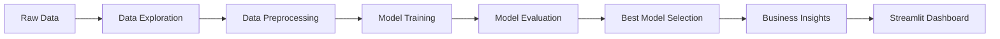

<!-- # Marketing ROI Optimizer

Projet Data Science M2 — Optimisation du Retour sur Investissement Marketing.

## Objectif

Construire un système intelligent capable de prédire les ventes à partir de budgets marketing :

- TV
- Radio
- Social Media
- Influencer

Variable cible : `Sales`

## Structure

```text
data/
src/
models/
reports/
app/
api/
logs/
notebooks/ -->


# 📊 Marketing Mix Modeling — Data Science Project

## 🚀 Overview
This project analyzes the impact of marketing channels on sales to optimize budget allocation.

### 🎯 Business Problem
How can we allocate marketing budget across channels (TV, Radio, Social Media, Influencers) to maximize sales and ROI?

---

## 🧠 Project Architecture



---

## 📂 Dataset
- TV advertising budget
- Radio budget
- Social Media budget
- Influencer category
- Sales (target)

---

## 🔍 Exploratory Data Analysis

### Correlation Insights
- TV → Sales ≈ 0.9995
- Radio → Sales ≈ 0.8691
- Social Media → Sales ≈ 0.5289

⚠️ Multicollinearity detected between channels.

---

## ⚙️ Models Tested
- Linear Regression ✅
- Random Forest
- Gradient Boosting

---

## 🏆 Best Model

MAE  = 2.31  
RMSE = 2.88  
R²   = 0.9990  

---

## 📉 Key Insight
TV explains almost all sales variance.  
Other channels add little incremental value.

---

## 💼 Business Interpretation
TV is the dominant driver.  
Correlation does not imply causation.  
Dataset limitations strongly influence results.

---

## 📊 Dashboard
Run the app:

```bash
streamlit run app/streamlit_app.py
```

---

## ⚠️ Limitations
- Biased dataset
- Multicollinearity
- No causal inference

---

## 🚀 Improvements
- Ridge / Lasso
- Better data collection
- Causal models

---

## 🧩 Conclusion
A strong model ≠ good decision tool without business understanding.
